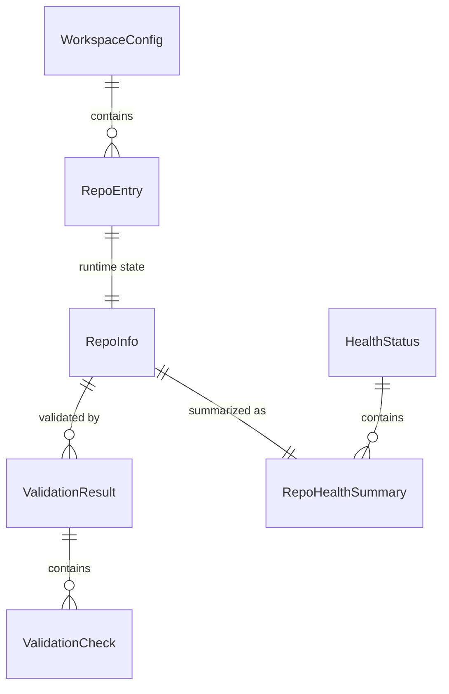

# Data Model: Developer Commands for Platform Management

**Feature**: 001-dev-commands
**Date**: 2026-02-07
**Source**: spec.md Key Entities + research.md decisions

## Entities

### WorkspaceConfig

Persistent workspace settings stored in `.vindicta-workspace.yml`.

```python
@dataclass
class WorkspaceConfig:
    """Workspace configuration persisted to .vindicta-workspace.yml."""

    # Identity
    schema_version: str = "1.0.0"
    workspace_root: Path = Path(".")

    # Repository Registry (can override defaults from registry.py)
    repositories: list[RepoEntry] = field(default_factory=list)

    # Sync Preferences
    parallel_count: int = 4          # Max concurrent sync operations
    auto_pull: bool = False          # Auto-pull on sync (vs fetch-only)
    sync_timeout: int = 120          # Timeout per repo in seconds

    # Validation Preferences
    auto_fix: bool = False           # Auto-fix validation issues
    constitution_check: bool = True  # Check constitution presence
    link_check: bool = True          # Check markdown link integrity

    # Setup Preferences
    install_hooks: bool = True       # Install pre-commit hooks
    create_venvs: bool = True        # Create Python virtual environments

    # Global
    default_tier: str | None = None  # Default tier filter (P0, P1, P2, P3)
    verbose: bool = False            # Default verbose mode
    json_output: bool = False        # Default JSON output mode
```

### RepoEntry

Entry in the repository registry.

```python
@dataclass
class RepoEntry:
    """Single repository in the workspace registry."""

    name: str                        # e.g., "Vindicta-Core"
    tier: str                        # "P0" | "P1" | "P2" | "P3"
    repo_type: str                   # "python" | "nodejs" | "mixed"
    github_url: str                  # Full GitHub clone URL
    local_path: Path | None = None   # Resolved local path (workspace-relative)
    present: bool = False            # Whether cloned locally
```

### RepoInfo

Runtime state of a repository (not persisted).

```python
@dataclass
class RepoInfo:
    """Runtime state of a single repository."""

    # Identity
    name: str
    tier: str
    repo_type: str
    local_path: Path

    # Git State
    current_branch: str = "main"
    default_branch: str = "main"
    is_on_default: bool = True
    is_dirty: bool = False
    ahead: int = 0
    behind: int = 0
    uncommitted_files: list[str] = field(default_factory=list)

    # Remote State (populated by status/sync)
    ci_status: str | None = None     # "passing" | "failing" | "pending" | None
    open_pr_count: int = 0
    last_commit_hash: str = ""
    last_commit_message: str = ""
    last_commit_date: str = ""
```

### ValidationResult

Outcome of a compliance validation run.

```python
@dataclass
class ValidationCheck:
    """Single validation check result."""

    name: str                        # e.g., "constitution_presence"
    passed: bool
    message: str                     # Human-readable status
    file_path: str | None = None     # Specific file if applicable
    line_number: int | None = None   # Specific line if applicable
    auto_fixable: bool = False       # Whether auto-fix can resolve
    fixed: bool = False              # Whether auto-fix was applied

@dataclass
class ValidationResult:
    """Aggregated validation results for a repository."""

    repo_name: str
    checks: list[ValidationCheck] = field(default_factory=list)
    total_passed: int = 0
    total_failed: int = 0
    total_fixed: int = 0
    compliance_score: float = 0.0    # 0.0 to 100.0

    @property
    def all_passed(self) -> bool:
        return self.total_failed == 0
```

### HealthStatus

Workspace-wide health snapshot.

```python
@dataclass
class RepoHealthSummary:
    """Health summary for a single repository."""

    name: str
    tier: str
    git_healthy: bool                # On default branch, not dirty, not behind
    ci_healthy: bool | None          # CI passing (None = not checked)
    pr_count: int
    issues: list[str]                # Human-readable issue descriptions

@dataclass
class HealthStatus:
    """Workspace-wide health snapshot."""

    timestamp: str                   # ISO 8601 datetime
    workspace_root: str
    total_repos: int
    healthy_count: int
    issue_count: int
    repos: list[RepoHealthSummary] = field(default_factory=list)

    # Tier-grouped summaries
    tier_summary: dict[str, dict] = field(default_factory=dict)
    # e.g., {"P0": {"total": 3, "healthy": 2, "issues": 1}, ...}
```

## Entity Relationships



## State Transitions

### Repository Lifecycle

```
ABSENT → CLONED → CONFIGURED → READY
  │                                │
  └── (init) ──→ (setup) ──→ (doctor validates)
```

- **ABSENT**: Not in workspace (not cloned)
- **CLONED**: Repository cloned but dependencies not installed
- **CONFIGURED**: Dependencies installed, hooks set up
- **READY**: All diagnostics pass (tools present, config valid)

### Sync State

```
CLEAN → FETCHED → PULLED
  │        │         │
  │        └── (ahead/behind reported)
  │
  └── DIRTY (skip with warning)
```

## Validation Rules

1. `WorkspaceConfig.schema_version` MUST be a valid semver string
2. `WorkspaceConfig.parallel_count` MUST be 1–16 (inclusive)
3. `WorkspaceConfig.sync_timeout` MUST be 10–600 seconds
4. `RepoEntry.tier` MUST be one of: "P0", "P1", "P2", "P3"
5. `RepoEntry.repo_type` MUST be one of: "python", "nodejs", "mixed"
6. `ValidationResult.compliance_score` = `(total_passed / (total_passed + total_failed)) * 100`
